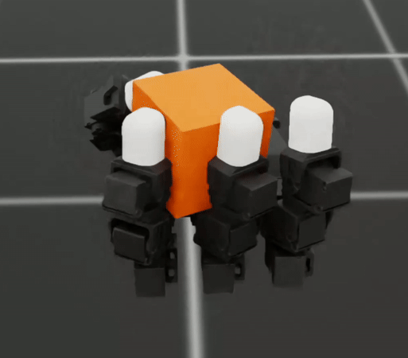

# LEAP Hand 1-Axis In-Hand Reorientation for Isaac Lab
This repository contains an IsaacLab environment extension  and sim2real deployment code for 1-axis in-hand reorientation. Note that this uses the proprioception of the motors alone to complete the task and no other external sensors.  For more information, please take a look at the LEAP hand [website](https://v1.leaphand.com/). 


## Installation
Download both Isaac Sim and IsaacLab from the [installation guide](https://isaac-sim.github.io/IsaacLab/main/source/setup/installation/index.html). This repository is tested on a conda environment with IsaacSim version 4.5 and Isaaclab version 2.1.0 on Ubuntu 22.04.

Start by activating the conda environment:
```bash
conda create -n isaaclab python=3.10
conda activate isaaclab
```

Download the repository and install the library:

```bash
git clone https://github.com/leap-hand/LEAP_Hand_Isaac_Lab.git
cd LEAP_Hand_Isaac_Lab
python -m pip install -e source/LEAP_Isaaclab
```




## Training a policy
Once in the `LEAP_Isaaclab` parent directory in your terminal, you can train a policy by entering the following command into the terminal. Note that the policies in this repository are tested with the `rl_games` library.

You can train a policy using the following command:
```bash
python scripts/rl_games/train.py --task Isaac-Reorient-Cube-Leap --headless
```

And visualize a policy with the following command:
```bash
python scripts/rl_games/play.py --task Isaac-Reorient-Cube-Leap --num_envs 1
```

## Sim2Real the Policy
This repository supports both a sim2real policy with the [LEAP Hand Python SDK](https://github.com/leap-hand/LEAP_Hand_API/tree/main/python) [LEAP Hand ROS2 SDK](https://github.com/leap-hand/LEAP_Hand_API/tree/main/ros2_module) (tested on ROS2 Humble on Ubuntu 22.04). 

We run the policy on a 7.5cm x 7.5cm x 7.5cm PLA 3-D printed cube weighing 281 grams.

## Python Version
Follow the instructions in the [LEAP Hand Python SDK](https://github.com/leap-hand/LEAP_Hand_API/tree/main/python) and install it.

Find the port of the LEAP hand and configure it in the script below.  The following command will enable the policy to directly command the LEAP hand to perform its specific task:

```bash
cd source/LEAP_Isaaclab/LEAP_Isaaclab/deployment_scripts
python reorient_z.py
```

## ROS2 Version
Follow the instructions in the [LEAP Hand ROS2 SDK](https://github.com/leap-hand/LEAP_Hand_API/tree/main/ros2_module) to install ROS2. Once you pass the `First time preparation` step there, go into `launch_leap.py` and comment out the `ros2_example.py` from the launch file. This will ensure that the subscriber and publisher to the LeapNode come from the ros2 file that we are deploying in this repository. 

Once this is done, simply run `ros2 launch launch_leap.py` to set the listener up.  Then in a new window:

```bash
cd source/LEAP_Isaaclab/LEAP_Isaaclab/deployment_scripts
python reorient_z_ros.py
```


### Deployment Notes
To launch the hand, make sure 5v power to the hand and the micro-usb to the hand.  Check [LEAP_Hand_API](https://github.com/leap-hand/LEAP_Hand_API/tree/main?tab=readme-ov-file) for more details. The [Dynamixel Wizard](https://emanual.robotis.com/docs/en/software/dynamixel/dynamixel_wizard2/) can help find the USB port.

Also look at [LEAP_Hand_API](https://github.com/leap-hand/LEAP_Hand_API/tree/main?tab=readme-ov-file) for tips on how you can improve the USB latency settings for improved deployment in the real world.

## Citing

This effort was led by [Sri Anumakonda](https://srianumakonda.com/) with assistance from [Kenneth Shaw](https://kennyshaw.net) and advising by [Ankur Handa](https://ankurhanda.github.io/) and [Deepak Pathak](https://www.cs.cmu.edu/~dpathak/)

If you find LEAP hand or this codebase useful in your research, please cite:
```
@article{
	shaw2023leaphand,
	title={LEAP Hand: Low-Cost, Efficient, and Anthropomorphic Hand for Robot Learning},
	author={Shaw, Kenneth and Agarwal, Ananye and Pathak, Deepak},
	journal={Robotics: Science and Systems (RSS)},
	year={2023}
}
```

If you need further assistance, feel free to reach out to us at [srianumakonda@cmu.edu](mailto:srianumakonda@cmu.edu) and [kshaw2@andrew.cmu.edu](mailto:kshaw2@andrew.cmu.edu) or open a GitHub issue if you encounter a bug.

**License:**  MIT License.  Provided **as‑is**, without warranty.


## Acknowledgements 

We build on top of the following codebases:
- LEAP Hand IsaacGym Implementation - [https://github.com/leap-hand/LEAP_Hand_Sim](https://github.com/leap-hand/LEAP_Hand_Sim)
- IsaacLab (and the Dextreme implementation) - [https://github.com/isaac-sim/IsaacLab](https://github.com/isaac-sim/IsaacLab)
- RL Games - [https://github.com/Denys88/rl_games](https://github.com/Denys88/rl_games)
- IsaacLab Extension Template - [https://github.com/isaac-sim/IsaacLabExtensionTemplate](https://github.com/isaac-sim/IsaacLabExtensionTemplate)

This work is supported in part by DARPA Machine Commonsense grant, AFOSR FA9550-23-1-0747, ONR N00014-22-1-2096 and Google Research Award.